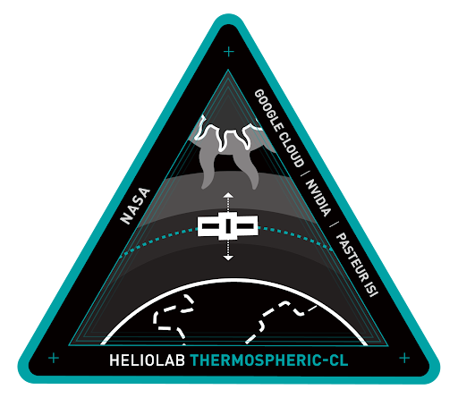

<p align="center">
  <br/>
  FDL-X Heliolab 2024<br/><strong>Thermospheric Density Continuous Learning</strong>
</p>

# Getting Started
This section includes an overview of this repository and how to quickly get moving with the codebase. 
## Repo structure
```bash
cloud               # all code related to cloud pipeline
│   ├── deployment  # terraform container directory
│   │   ├── src     # cloud functions
│   │   │   ├── satellite_data
│   │   │   │   ├── ingestion      # module to import updating satellite data streams
│   │   │   │   └── process        # module to assimilate all data streams  
│   │   │   └── satellite_indices  # module to collect indices
│   └── messages
├── karman
│   ├── io
├── models          # model checkpoints
├── notebooks       # examples
└── scripts         # all scripts that use the `karman` package
```

## Environment Setup
* Step 0: Install [uv](https://docs.astral.sh/uv/getting-started/installation/)
* Step 1: `uv sync` to create the virtual environment and install all dependencies
* Step 2: `uv run <script>` to run scripts, or activate the venv with `source .venv/bin/activate`

To install in development (editable) mode: `uv pip install -e .`

## Models Available
(table of models) 


# Background
In recent years, there has been an increasing interest in space-based communication, navigation, or remote sensing solutions provided by constellations of satellites in the low-Earth orbit (LEO, the region of space from approximately 200 to 2000 km above mean sea level, AMSL). This has brought a rapid growth in the number of both operational satellites and debris in LEO, which has accentuated the need to predict their trajectories with the goal of mitigating the risk of collisions in such a congested domain. Such risk of collision is particularly important due to the presence of space debris (inoperable satellites or associated launch vehicles and support systems)  with the potential of triggering a cascade of collisions (i.e., something referred to as Kessler syndrome) that could greatly increase the risk of launching into or through LEO.

Currently, the largest source of uncertainty in the precise location of resident space objects in LEO up to about 600–800 km AMSL is the highly variable neutral mass density in the Earth’s thermosphere. Thermospheric density variation causes varying drag forces on LEO satellites and debris which in turn cause changes in altitude and in-track location. The prediction of thermospheric density variation is a challenging problem, owing to its dependence on space weather conditions and its coupling with other layers of the upper atmosphere and heliosphere. Different physical phenomena, such as solar wind, solar radiation, and geomagnetic activity exhibit great variability, which extends to their interaction within the magnetosphere, ionosphere, and thermosphere. These interactions can induce sudden increases in temperature which results in upward expansion of the thermosphere , leading to increased density as a given LEO altitude and enhanced drag forces. Large unpredicted  variations in thermospheric density pose  a serious challenge for orbit planning and in worst-case scenarios can lead to early   re-entry of satellites. An example is the 2022 Starlink incident, which resulted in the loss of nearly 40 satellites of the constellation followling a low-LEO launch into unexpectedly high thermospheric density conditions due to an on-going minor  geomagnetic storm. Therefore, the need for advanced methods and models to forecast the state of the upper atmosphere is critical for ensuring the safety  of space-based missions operating in LEO (Berger et al. 2020).

Empirical models of the Earth’s upper atmosphere have been traditionally used to interpret the thermospheric response to space weather inputs. This is the case of the US Space Force (USSF) High Accuracy Satellite Drag Model (HASDM, Storz et al. 2005), the Jacchia-Bowman (JB) series of models (Bowman et al. 2008), or the Naval Research Laboratory Mass Spectrometer Incoherent Scatter model (NRLMSIS, also referred to as MSIS, Piccone et al. 2002). The HASDM model in particular  combines the hydrostatic JB08 model  with observational data from LEO satellite and debris radar tracking information  to provide accurate “nowcasts” and up to several days of predicted global thermospheric density conditions. . However, they have  limited forecasting accuracy due to their hydrostatic empirical structure , which fails to capture dynamic changes due to geomagnetic storming, particularly in  high-latitude regions.

Physics-based models of the thermosphere and ionosphere systems have been developed to improve the modeling and prediction power of empirical models. This is the case of the Thermosphere-Ionosphere-Electrodynamics General Circulation model (TIE-GCM, Qian et al. 2014), the Global Ionosphere-Thermosphere model (GITM, Ridley et al. 2006), the Coupled Ionosphere-Thermosphere Plasmasphere electrodynamics model (CTIPe, Codrescu et al. 2012), the Whole Atmosphere Community Climate Model with thermospheric extension (WACCM-X, Liu et al. 2018) or the Whole Atmosphere Model-Ionosphere Plasmasphere Electrodynamics (WAM-IPE, Jackson et al. 2019).These models solve the large systems of equations arising from the discretization of the conservation equations of mass, momentum, energy, and charge for several neutral and ion species. However, while comprehensive, these models still introduce several simplifications and display a high parametric uncertainty. In addition, they are computationally expensive and require extensive tuning to replicate complex geomagnetic responses, which makes them costly to use  operationally.

In recent years, fully data-driven models have emerged as an alternative to empirical and physics-based models. These options are aimed at learning the complex behavior of the upper atmosphere by ingesting big amounts of data. This is the case of KARMAN (Benson et al., Bonasera et al., Brown et al. 2021, Acciarini et al. 2023) is an open-source machine learning software package that was developed to address the need for the accurate prediction of thermospheric density during FDL (2021 - 2023). KARMAN has shown increased levels of accuracy with respect to empirical models while retaining its operational capabilities.
Other alternatives have aimed at the construction of surrogates that encapsulate the physical behavior of thermospheric models, extending the idea behind reduced-order models via the machine learning paradigm (Turner et al. 2020, Licata & Mehta 2022)).

While KARMAN has demonstrated superior performance compared to state-of-the-art empirical models, the recent and ongoing surge in space assets at Low Earth orbit (LEO) coupled with the effects of solar cycle variations, require a model that can adapt to new data quickly. To this end, this project aims to build on the KARMAN framework by developing a continual learning (CL) system that will allow for model updation as new data becomes available, turning the congestion challenge into an opportunity for enhancing the model predictions and enabling reliable thermospheric density nowcasting and forecasting.

Continual learning is set to not only handle the live ingestion of data and real-time data fusion but also to provide build an active learning system where the machine learning model regularly updates their weights and biases to improve the accuracy of its predictions without forgetting key features of previous forecasts (He & Sick 2021, Kirkpatrick et al., 2017, Hadsell et al., 2020). Therefore, such a framework can permit for efficient error estimation and data assimilation, thus enabling reliable thermospheric density forecasting with improved accuracy. In this manner, this challenge aims at tackling one of the most important challenges for space operations while a relevant scientific problem for the upper atmospheric community.


# Acknowledgements
This work is the research product of FDL-X Heliolab a public/private partnership between NASA, Trillium Technologies Inc (trillium.tech) and commercial AI partners Google Cloud, NVIDIA and Pasteur Labs & ISI, developing open science for all Humankind. 
